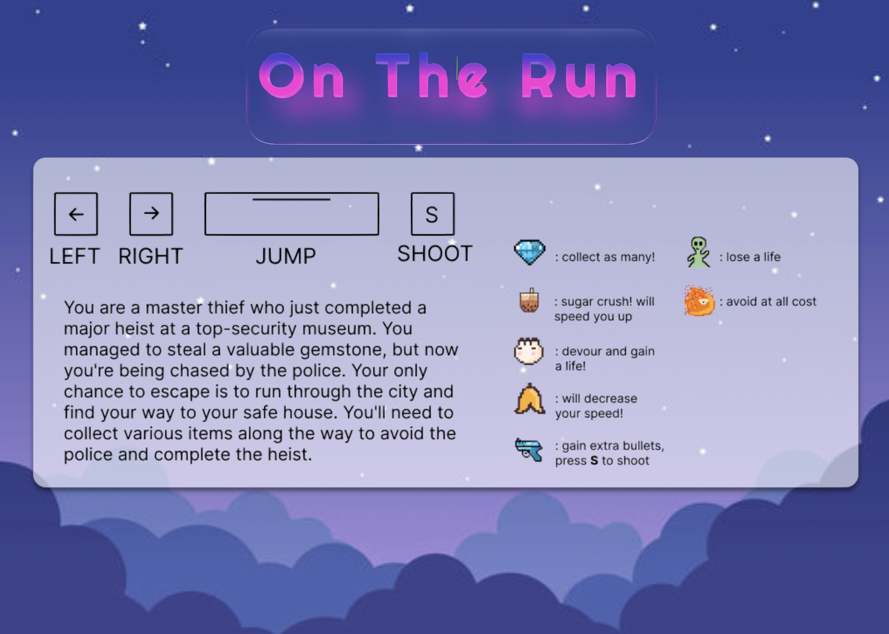
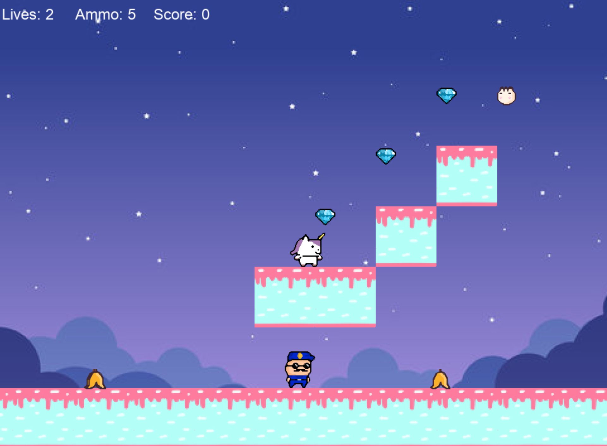
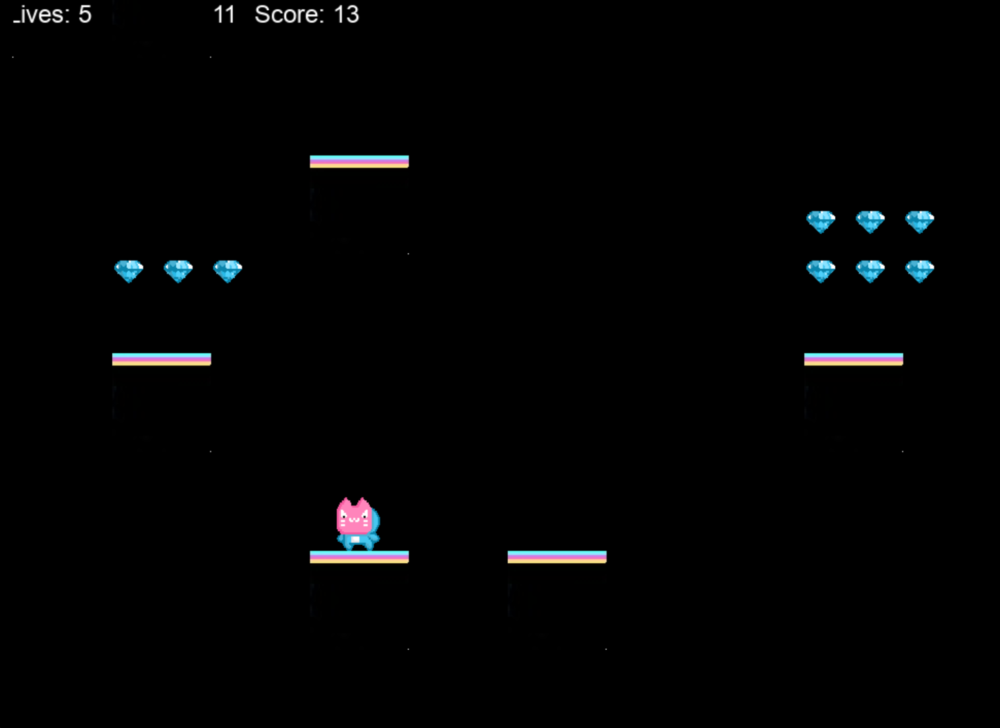
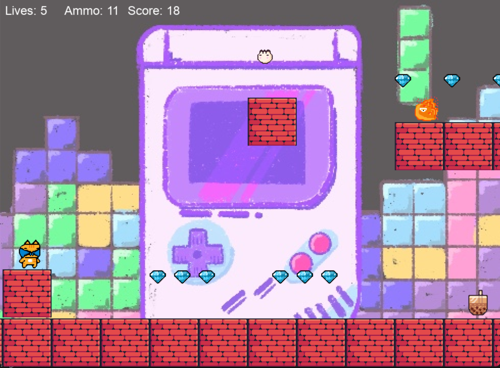

# On The Run
## Inspiration
Our game is inspired by Maple Story and features a multiverse theme inspired by Everything Everywhere All At Once. 
Designed to be accessible for beginners, the game includes unique characters, items, environments, and game play mechanics. 
Players can explore different multiverses, encounter creatures from alternate realities, and follow a fun and engaging story. 
This is a game that can be enjoyed by players of all experience levels.

## What it does
In this game, players collect items and reach their destination while navigating a multitude of challenges and obstacles. 
With fast-paced platform runner mechanics, the game requires quick reflexes, strategic thinking, and precise timing to traverse each level successfully.

## Demo + Screenshots







## Installation Steps:

1. Clone this GitHub repository

2. Install the dependencies (python 3, pip, pygame 2.3.0)

```
python3 install
pip install
pip install pygame --upgrade
```

## Run the game:

1. Open the project folder

```
cd pygame_hackathon
```

2. Start the game

```
python3 main.py
```

## Package with Pyinstaller

```
pyinstaller main.spec
```